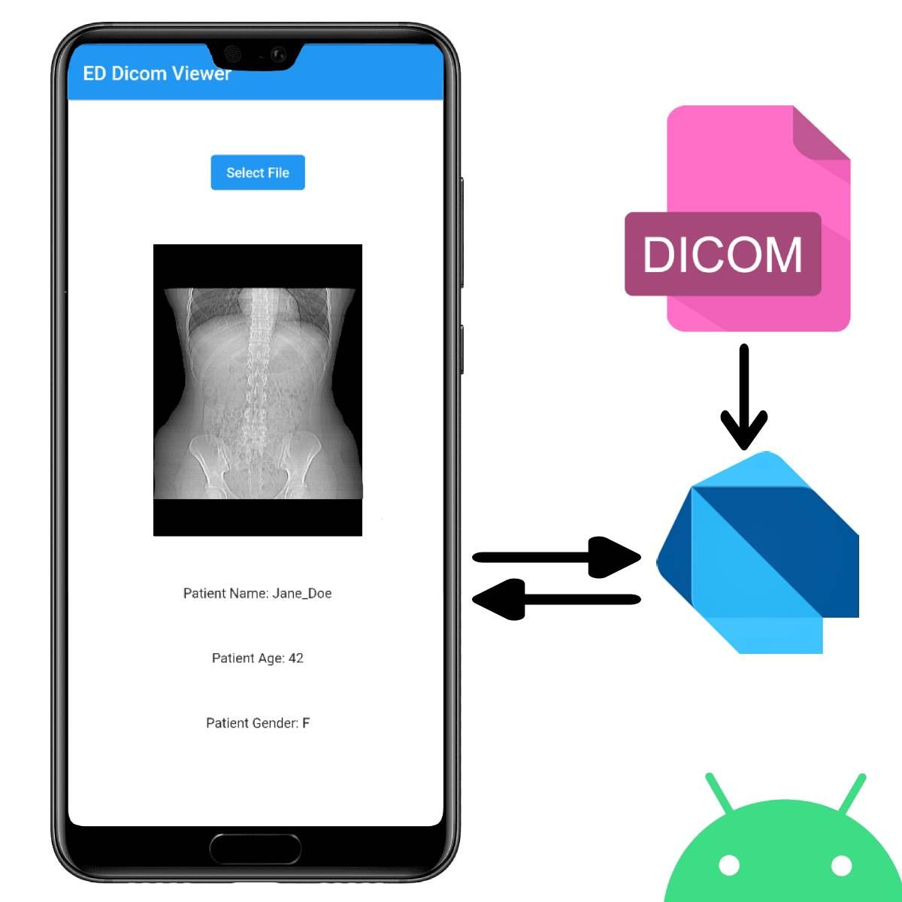

# ED Dicom Viewer

## <span style="color: red"> For now it only supports Android. iOS coming soon! </span>

ED Dicom Viewer is an innovative tool designed to effectively process and analyze DICOM files on the Flutter platform. This comprehensive solution stands out with its ability to easily read basic DICOM data such as patient information, as well as convert MR images contained in the files into Flutter compatible images. ED Dicom Viewer is ideal for increasing efficiency in your medical imaging projects and providing rich image processing capabilities in Flutter-based applications.Imebra SDK was used for Android.

## Who made it? It's Eren ;)

[](https://pub.dev/packages/ed_dicom_viewer)

<div align="center">

</div>

## Installation

To use ED Dicom Viewer in your Dart project, add it to your project's pubspec.yaml file under dependencies:

```
  dependencies:
    ed_dicom_viewer: <latest_version>
```

Then, run the following command to install the package:

```
  dart pub get
```

## Usage

```dart
import 'package:ed_dicom_viewer/ed_dicom_viewer.dart';

final _dicomViewerPlugin = EdDicomViewer();

EdDicomModel response = await _dicomViewerPlugin.getViewDicom('---Dicom File Path---');

```

## Contributors

Author: endmr11 [](https://github.com/endmr11)

## Feedback

If you have any feedback, please contact us at erndemir.1@gmail.com.
